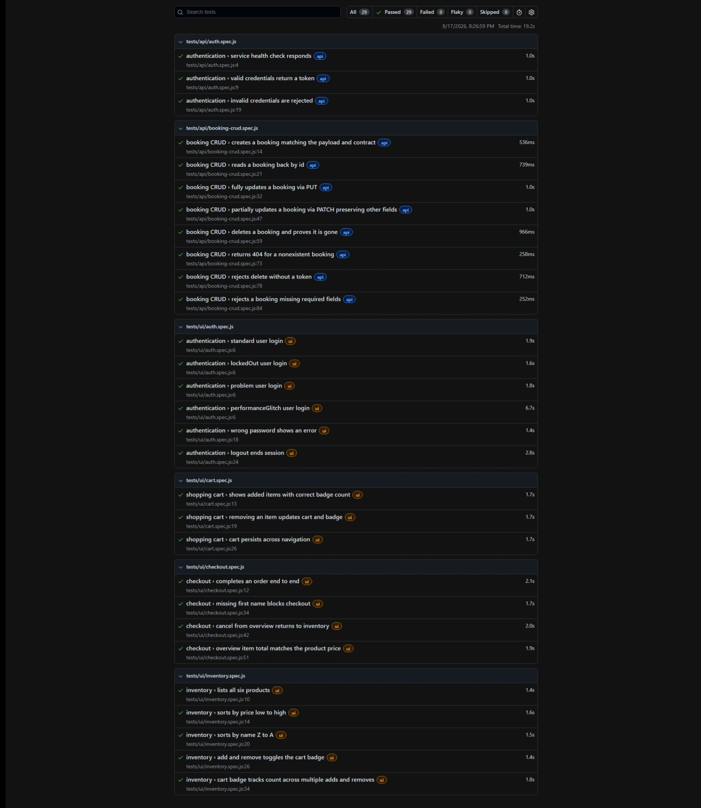

# Playwright Test Automation Framework

This is a Playwright framework built with javascript, covering UI automation against SauceDemo and
API automation against Restful-Booker. It is designed the way I would build a framework for a
team to maintain over the long-term. Every test is fully independent and safe to run
in parallel. API responses are validated at both the value and contract level
using ajv and JSON schemas. Test data is generated independently for each test using factories and
cleaned up automatically during teardown. The GitHub Actions pipeline runs the
suites in parallel jobs, with cached browsers and test report artifacts on every push.

## Prerequisites

- Node.js 22 (LTS) — verify with `node --version`
- Git

## Setup

```bash
git clone https://github.com/DikshaMunilal/playwright-test-automation-framework.git
cd playwright-test-automation-framework
npm ci                            # install exact locked dependencies
npx playwright install chromium   # download the pinned browser binary
cp .env.example .env              # Windows: copy .env.example .env
```

No further configuration is needed — `.env.example` contains working values for the
public demo targets.

## Running Tests

| Command | What it does |
|---|---|
| `npm test` | Run everything — API + UI, in parallel |
| `npm run test:api` | API suite only (no browser) |
| `npm run test:ui` | UI suite only |
| `npm run test:headed` | UI suite with a visible browser |
| `npx playwright test tests/ui/checkout.spec.js` | Run a single spec file |
| `npx playwright test -g "deletes a booking"` | Run tests matching a name |
| `npx playwright test --list` | List all tests without running them |

A full `npm test` run executes **29 tests (11 API + 18 UI)** and completes in
under 30 seconds.

## Viewing Results

**Terminal** — pass/fail summary prints after every run.

**Playwright HTML report** — rich per-test detail, steps, and traces:

```bash
npm run report
```

**Monocart report** — open `monocart-report/index.html` in a browser after any run.

**CI reports** — on any [Actions](https://github.com/DikshaMunilal/playwright-test-automation-framework/actions)
run, scroll to **Artifacts**, download `api-reports` or `ui-reports`, extract, and
open `playwright-report/index.html` or `monocart-report/index.html`.

## Project Structure

```
├── .github/workflows/
│   └── ci.yml                  # Parallel api/ui jobs, browser cache, report artifacts
├── src/                        # Framework code — no tests live here
│   ├── api/
│   │   └── booking.client.js   # API wrapper; encapsulates auth token-as-cookie quirk
│   ├── data/
│   │   ├── users.js            # SauceDemo user matrix (frozen map, drives parameterized auth)
│   │   ├── booking.factory.js  # Booking generator — single source of truth for payload + assertions
│   │   └── customer.factory.js # Checkout customer generator
│   ├── fixtures/
│   │   ├── api.fixtures.js     # Worker-scoped auth token + auto-cleanup of created bookings
│   │   └── ui.fixtures.js      # Injects page objects into tests
│   ├── pages/                  # Page objects — locators + intent-level actions, no assertions
│   │   ├── login.page.js
│   │   ├── inventory.page.js
│   │   ├── cart.page.js
│   │   └── checkout.page.js
│   └── schemas/
│       └── booking.schema.js   # ajv JSON schemas — API contract validation
├── tests/
│   ├── api/                    # auth + booking CRUD (incl. DELETE with 404 proof)
│   └── ui/                     # auth, inventory, cart, checkout
├── playwright.config.js        # Two projects (api/ui), fullyParallel, CI-aware retries/workers
└── .env.example                # Config template — copy to .env (gitignored)
```

**The rule:** `src/` is the framework (how), `tests/` are the specs (what). Tests read
as intent; mechanics live behind page objects, the API client, and fixtures.

## Coverage Map

| Scope area | Tests | Spec file |
|---|---|---|
| API — authentication | 3 (incl. invalid credentials) | tests/api/auth.spec.js |
| API — booking CRUD | 8 — all verbs, DELETE proven via 404, negative create | tests/api/booking-crud.spec.js |
| UI — authentication | 6 — 4 user types, wrong password, logout w/ session check | tests/ui/auth.spec.js |
| UI — inventory | 5 — listing, 2 sorts, badge toggle + count | tests/ui/inventory.spec.js |
| UI — cart | 3 — contents, removal, persistence | tests/ui/cart.spec.js |
| UI — checkout | 4 — E2E, price consistency, validation, cancel | tests/ui/checkout.spec.js |

For the live, always-accurate list: `npx playwright test --list`

## Design Decisions

**Fixtures over inheritance.** Tests receive page objects and API clients through Playwright fixtures rather than base-class inheritance chains. Composition keeps dependencies explicit in each test, while fixture teardown ensures resources are cleaned up even when a test fails.

**One config, two projects.** UI and API tests live under a single Playwright configuration as separate projects. This provides unified reporting and allows individual projects to be run using --project. The API project uses Playwright's API capabilities and does not require browser startup.

**Factories as the single source of truth.** makeBooking() output is used as the POST payload and as the basis for expected values in assertions, reducing the risk of payload and expectation drift. Overrides allow tests to specify only the values relevant to a scenario, for example: makeBooking({ totalprice: 999 }).

**Randomize what creates isolation; fix what creates risk.** Names and prices are Faker-generated to reduce the risk of collisions when parallel tests run against the shared public API. Dates are fixed because random dates would add unnecessary variability without increasing test coverage. In a long-lived framework, I would calculate dates relative to the current date rather than rely on hard-coded values.

**Leave-no-trace test data.** Every created booking is registered with a cleanup fixture and deleted during teardown, regardless of whether the test passes or fails. Cleanup tolerates 404 responses so that cleanup failures do not obscure the original test result.

**Contract and value validation are different layers.** AJV with JSON Schema validates the response structure and data types, while value assertions verify that the returned data matches the request or expected behaviour. CRUD tests use both layers to validate structural and functional correctness.

**Worker-scoped authentication.** The API token is acquired once per worker rather than once per test, reducing unnecessary authentication requests. The token is treated as reusable for the lifetime of the worker.

**DELETE is proven, not assumed.** The DELETE test asserts the expected status code and then performs a GET for the deleted booking, expecting a 404. This verifies that the resource was actually removed rather than relying on the DELETE response alone.

**Deliberate omissions.** No BDD layer is included because it would add unnecessary ceremony for the scope of this assessment. Load testing is also outside the scope of the framework; a dedicated load-testing tool such as k6 would be more appropriate for that purpose. CI runs Chromium only to keep feedback fast, while Playwright can be configured for additional browsers when required.

**Zero hard waits.** No waitForTimeout calls are used, and selectors avoid brittle index-based targeting. Playwright's web-first assertions automatically retry until the expected condition is met or the assertion times out. Locators use data-test attributes through Playwright's testIdAttribute configuration and accessible roles where appropriate.

## CI

Every push to, and pull request targeting, `main` triggers the pipeline
([`.github/workflows/ci.yml`](.github/workflows/ci.yml)) with two jobs running in parallel:

- **api-tests** — installs dependencies and runs the API project. It does not
  install any browser binaries, and the suite typically finishes in ~20 seconds.
- **ui-tests** — restores the Chromium binary from a cache keyed by the
  Playwright version. A Playwright version change automatically invalidates
  the cache; Chromium is installed only on a cache miss before the UI project runs.

Both jobs run on Node 22 to match the local development environment. Both jobs
upload the Playwright HTML and Monocart reports as artifacts using `if: always()`,
so reports are uploaded even when tests fail — because evidence matters most
when tests fail.

**Viewing results:** open any workflow run under
[Actions](https://github.com/DikshaMunilal/playwright-test-automation-framework/actions),
scroll to **Artifacts**, download `api-reports` or `ui-reports`, and open
`playwright-report/index.html` or `monocart-report/index.html` from the extracted
archive.

## Test Evidence

**Local execution** — full suite (11 API + 18 UI) using parallel workers:



**Pipeline execution** — every push to `main` runs both suites on GitHub Actions.
See any successful run under
[Actions](https://github.com/DikshaMunilal/playwright-test-automation-framework/actions),
where the Playwright HTML and Monocart reports are available as downloadable
artifacts (`api-reports` and `ui-reports`). Reports are uploaded even when tests fail.

To reproduce locally, run `npm test`, then `npm run report`.

## Known API Quirks (Restful-Booker)

Restful-Booker is a practice API with some intentional and implementation-specific
quirks. The tests assert the API's *actual* behaviour rather than assuming what a
conventional REST API would return. The client (`src/api/booking.client.js`)
encapsulates these API-specific details so that the tests remain clean:

| Quirk | Conventional expectation | What the framework does |
|---|---|---|
| Successful `DELETE` returns **201 Created** | 204 No Content | The test asserts `201`, then verifies deletion with a follow-up GET expecting **404** |
| Write operations (PUT/PATCH/DELETE) authenticate via `Cookie: token=...` | `Authorization: Bearer <token>` | The authentication header is handled privately by the client; tests do not interact with the authentication mechanism |
| Invalid credentials return **200** with `{ "reason": "Bad credentials" }` | 401 Unauthorized | The test asserts the actual status code and response body |
| Validation failures on create return **500** | 400 Bad Request | The test asserts the actual observed status |
| Shared public instance — data from other users exists and resets periodically | Isolated test environment | Tests never rely on global state; each test creates and cleans up its own bookings |

If the API's behaviour changes (for example, if `DELETE` starts returning `204`),
these tests will fail deliberately. The tests pin the currently observed API
behaviour; when that behaviour changes, we want to know.